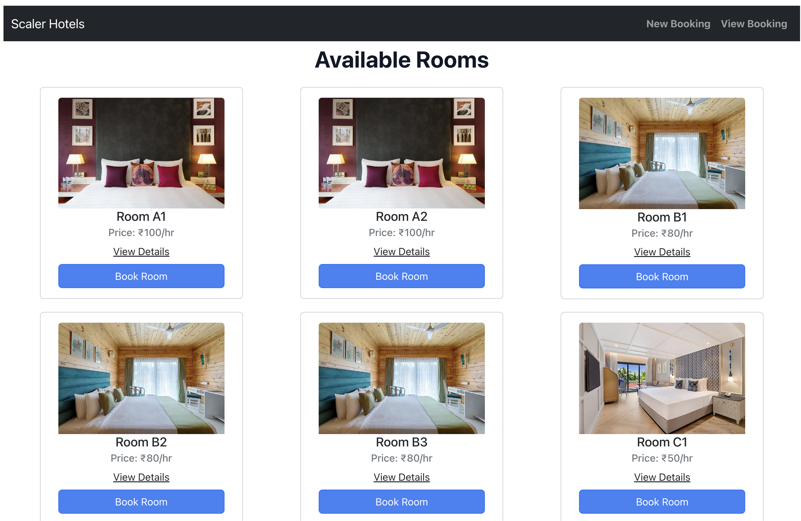
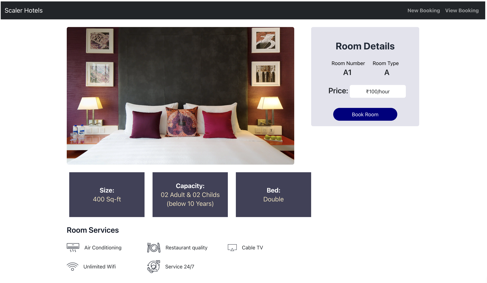
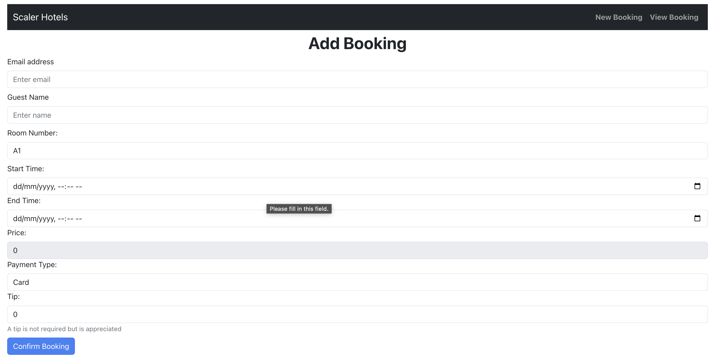
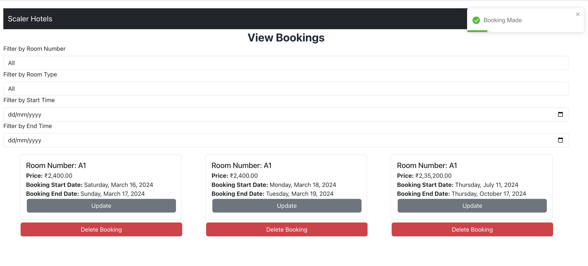
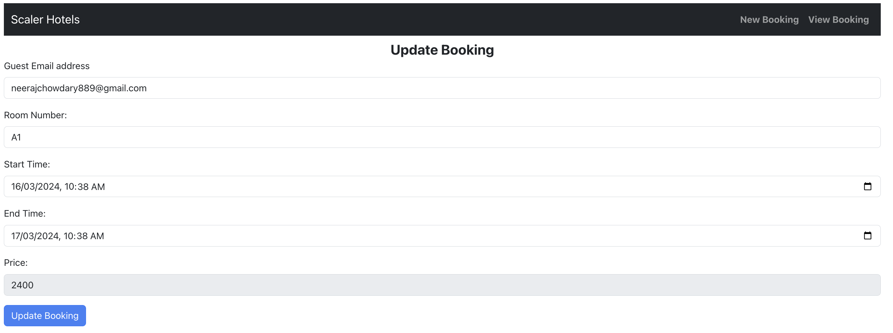
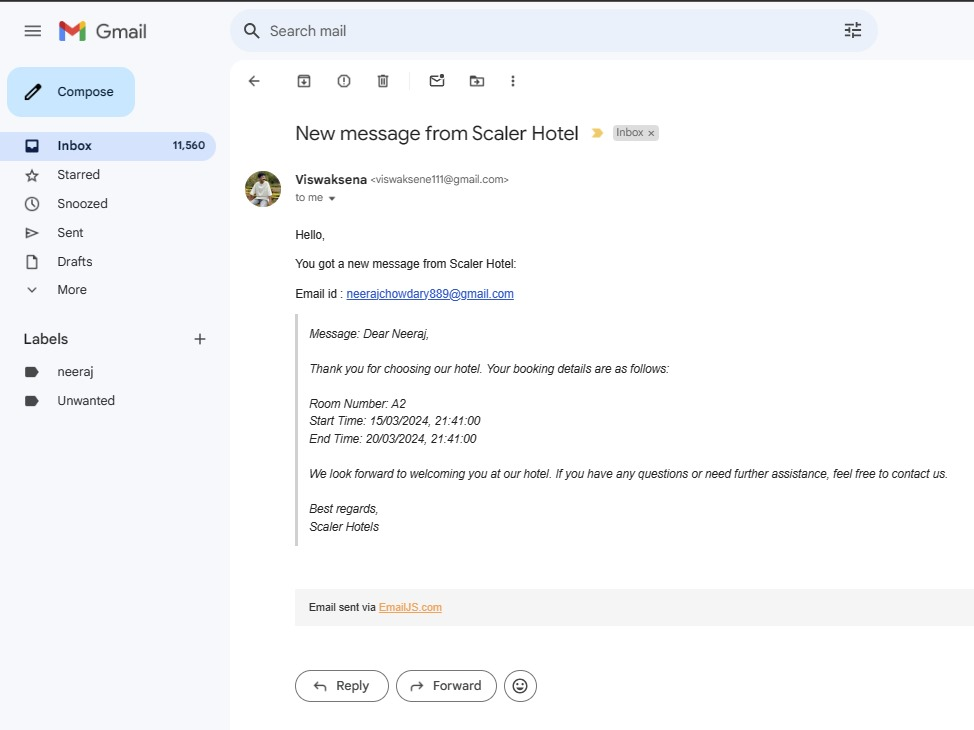

# Scalar Hotel - Admin Room Management System

Versal App: [`https://scalar-hotel.vercel.app/`](https://scalar-hotel.vercel.app/)

## Tech Stack

### MERN Stack

### Frontend

### Development Environment

 

## Scalar Hotel

### <u>Description</u>

This project is a complete admin-facing solution for managing rooms in a hotel. It allows hotel administrators to efficiently handle room bookings, modifications, cancellations, and viewing bookings with various filtering options.

### <u> Features </u>

**Room Booking**: Admins can book rooms by specifying user email, room number, start time, and end time. The pricing updates dynamically based on the selected room and time duration.

**Edit Booking**: Admins can edit booking details such as user email, room number, start time, and end time, with corresponding confirmation on updated pricing.

**Cancellation Policy**: Admins can cancel bookings with different refund policies:

- If the booking start time is more than 48 hours away, a complete refund is provided.
- If the booking start time is within 24 to 48 hours, a 50% refund is provided.
- Otherwise, no refund is issued, but the admin can still cancel the booking.

**View Bookings**: Admins can view all bookings, including upcoming and past ones, with filtering options based on room number, room type, start time, and end time.

### <u>Extra Functionalities</u>

**Email Notifications**: Automatic email notifications are sent to users upon booking, containing the details of their reservation.

**Responsive Design**: The application is designed to be responsive, ensuring optimal user experience across different devices and screen sizes.

### <u>Technologies Used</u>

**Frontend**: Single Page Application (SPA) developed using HTML, CSS, and Bootstrap.

**Backend**: Utilizes a MongoDB database and a Nodejs as a server-side language for handling CRUD operations and business logic.

## Scalar Hotel Screenshots

<h2>Homepage</h2>

<h2>Room Details</h2>

<h2>Room Booking</h2>

<h2>View Booking Details</h2>

<h2>Edit Booking Details</h2>

<h2>Email Notification</h2>

